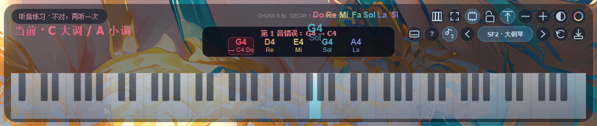
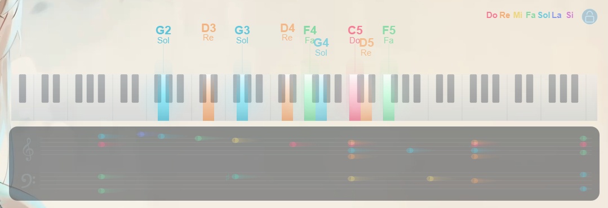
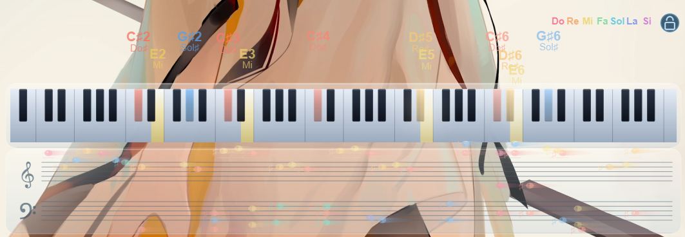
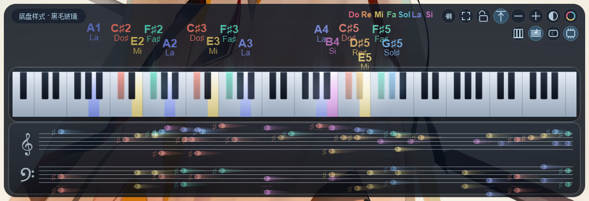
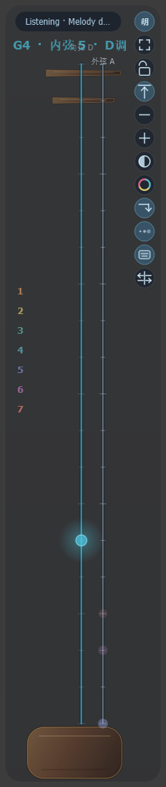
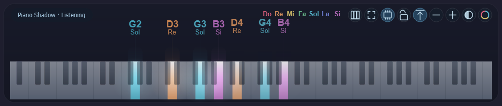
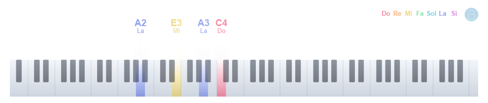
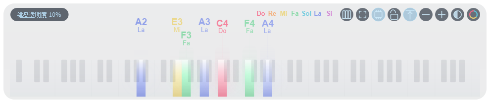

# Piano Shadow

English | [简体中文](README.md)

Piano Shadow is a local desktop music-visualization and performance tool. It started as a translucent piano-note overlay: it captures system audio, uses Piano GPU or Spotify Basic Pitch to transcribe piano notes, and projects recent notes onto an 88-key keyboard. It now also includes computer-keyboard/MIDI performance mode, switchable instruments and sound sources, ear training, piano key/solfege association, and an experimental Erhu Shadow mode for real-time continuous-pitch visualization. It is designed for listening practice, key-position association, and performance assistance, not professional score transcription. Audio stays local; no cloud API is used.

Current version: `0.7.0`

## Features

### Piano transcription overlay

- Translucent floating 88-key piano overlay.
- Captures system output through WASAPI loopback / monitor sources.
- Two piano recognition backends:
  - `Piano GPU`: higher-accuracy pure-piano model, using a local CUDA environment when available.
  - `Basic Pitch`: bundled CPU/ONNX fallback for general use.
- Note names, fixed solfege, key highlights, trails, and glow beams share one 12-tone color system.
- The same pitch class keeps the same hue across octaves, with subtle low/dark and high/bright offsets.
- Independent opacity controls for the glass/keyboard layer and the colorful active-note layer.
- Keyboard-only mode, topmost toggle, lock, click-through, tray show/hide, and reset-to-default controls.

### Piano performance mode

- Play with the computer keyboard or a MIDI keyboard.
- Keyboard rows continue diatonically, making two-hand playing easier:
  - `F1–F12`: low range
  - `1–=`: lower-middle range, with `8 9 0 - =` continuing into the next octave
  - `Q–]`, `A–'`, `Z–/`: higher ranges
- `← / →` move around the circle of fifths: `C/A minor → G/E minor → D/B minor ...`
- `↑ / ↓` shift the whole keyboard range by octave.
- `Shift` temporarily raises by a semitone; `Ctrl` temporarily lowers by a semitone.
- `Space` is sustain/vibrato, `Enter` is rest, and `Alt + target note` is glide for instruments that support it.
- Performance mode marks the current computer-key tonic anchor directly on the piano keys:
  - C key: `Q/C4`
  - G key: `Q/G4`
  - other ranges show row-start keys such as `F1`, `1`, `A`, and `Z`
  - octave shifts move the anchors with the mapping, so scale changes remain readable.
- Performance mode also adds a compact arrow-pad control: left/right change keys around the circle of fifths, and up/down shift octave.

### Instruments and sound sources

- Default output uses Windows WinMM General MIDI; no extra soundfont is required.
- Performance mode provides previous instrument, current source/instrument, next instrument, reset, and soundfont-management controls.
- Built-in common programs include piano, electric piano, organ, guitar, bass, strings, brass, saxophone, flute, synth, and an approximate erhu.
- The app can download GeneralUser GS SoundFont into:

```text
%LOCALAPPDATA%\PianoShadow\soundfonts\GeneralUser-GS.sf2
```

- Downloads use progress reporting, fallback mirrors, fixed SHA-256 verification, and atomic `.part` installation.
- After installation, the UI can switch between `WIN` and `SF2`.

### Ear training

- Available in performance mode.
- Repeated clicks cycle through: `1 note → 3 notes → 5 notes → 7 notes → off`.
- Each question plays a prompt first, then listens for the user's answer.
- Correct answers advance automatically; wrong answers show the wrong index, played note, and expected note.
- Prompt playback does not light the keyboard. Only user answers trigger key highlights.
- If the user does not start answering within two seconds after the prompt, the same prompt is replayed.
- Questions follow the current key and include single notes, diatonic triads/inversions, pentatonic material, and full-mode fragments.

### Staff Shadow

- Piano mode has a second-row toggle for the staff trace. It is off by default.
- When enabled, a double staff is shown below the 88-key keyboard: treble staff plus bass staff.
- Recognized notes enter from the right and flow left, giving a quick view of pitch contour.
- This is not strict rhythmic engraving. It does not treat model note durations as formal notation; it is a live visual trace.
- Staff lines, clefs, and background follow keyboard opacity. Notes and trails follow the pitch-class color system and active-note opacity.
- The keyboard base and staff panel share the same frosted-glass style, with a toggle between dark glass and light glass.
- In keyboard-only / click-through mode, enabled staff lines and notes remain visible while the staff area still passes mouse input through.

### Erhu Shadow

- This is an exploratory feature. It can show continuous pitch motion and approximate string position, but recognition accuracy is not yet stable enough for reliable transcription or real erhu fingering judgment.
- Switch between Piano Shadow and Erhu Shadow with the top-right “钢/胡” button or the context menu.
- Erhu mode does not rely on Basic Pitch NoteEvents. It uses a real-time pitch tracker for continuous F0.
- Standard tuning:
  - Inner string: D4
  - Outer string: A4
- The glowing point represents absolute pitch position on a string:
  - open string is position 0
  - each semitone raises position by 1
  - each string displays positions 0–18
- Horizontal/vertical layouts, history trail, resonator/peg visibility, and mirrored view are supported.
- In vertical mode, lower on screen means higher pitch.
- A string-selection state machine prevents unstable jumping between inner and outer strings:
  - keep the previous string by default
  - ignore low-confidence frames
  - switch only after another string remains clearly better
  - open-string tolerance keeps slightly flat/sharp D4 and A4 stable
- Key display can be Auto, D, G, F, Bb, C, or A. It changes only the numeric notation text, not the physical pitch position.

## Screenshots

These screenshots were captured during development and may not match every pixel of the latest version, but they show the intended feature shape.

### Ear training



### Staff Shadow



### Frosted glass base styles





### Erhu Shadow



Older piano overlay screenshots are also kept:







## Windows installation

Download the installer from GitHub Releases:

```text
PianoShadow-Setup-v0.7.0-Windows-x64.exe
```

The installer does not require users to install Python. Default paths:

- App: `%LOCALAPPDATA%\Programs\PianoShadow`
- Models: `%LOCALAPPDATA%\PianoShadow\models`
- SoundFonts: `%LOCALAPPDATA%\PianoShadow\soundfonts`
- Logs: `%LOCALAPPDATA%\PianoShadow\logs`

The installer can create a desktop shortcut and enable launch at login. Upgrades and uninstalling keep downloaded models and soundfonts by default.

### Windows usage notes

1. Make sure your player outputs to the default speaker.
2. Start Piano Shadow.
3. Piano mode is the default. Click “胡” to switch to Erhu Shadow.
4. Erhu mode is ready when the status shows `Listening · Pitch Tracker`.
5. If the overlay is not visible, use the tray icon to show/hide or reset settings.

Some Bluetooth hands-free devices, exclusive-mode players, and virtual devices do not provide WASAPI loopback. If capture fails, switch to normal speakers and disable exclusive mode.

### Running from source on Windows

```powershell
Set-ExecutionPolicy -Scope Process Bypass
.\setup-windows.ps1
.\run-windows.ps1
```

UI/demo only:

```powershell
.\setup-windows.ps1 -DemoOnly
.\run-windows.ps1 -Demo
```

Install CUDA PyTorch for Piano GPU:

```powershell
.\setup-windows.ps1 -Gpu
```

The installed app can detect `%LOCALAPPDATA%\PianoShadow\venv` and call the local CUDA bridge process. The 4GB+ CUDA runtime is not bundled inside the EXE.

### Building on Windows

```powershell
.\build-installer.ps1 -Version 0.7.0
```

Requires Inno Setup 6. Outputs are written to `dist`:

```text
PianoShadow-v0.7.0-Windows-x64.exe
PianoShadow-Setup-v0.7.0-Windows-x64.exe
```

## Linux / WSL / source usage

On Linux, Piano Shadow uses `soundcard` to find the monitor source of the default output device. PipeWire users usually need the `pipewire-pulse` compatibility layer.

```bash
pactl get-default-sink
pactl list short sources
```

The source list should include something like:

```text
alsa_output....monitor
```

Run from source:

```bash
python -m venv .venv
source .venv/bin/activate
python -m pip install -U pip
pip install -r requirements.txt
python main.py
```

UI only:

```bash
pip install -r requirements-demo.txt
python main.py --demo-mode
```

Erhu demo:

```bash
python main.py --demo-midi "62;64;66;67;69;71;72;74"
```

WSLg/Wayland support for frameless windows, topmost behavior, and click-through varies by compositor. If you see `This plugin does not support raise()`, the compositor is refusing forced topmost behavior. You can try:

```bash
QT_QPA_PLATFORM=xcb python main.py --demo-mode
```

For the most stable topmost and multi-monitor behavior, use the Windows installer or launch with Windows Python.

## FAQ

- No audio input: check the default speaker, player output device, Windows exclusive mode, or Linux monitor source.
- Piano recognition latency: CPU mode uses rolling context; GPU mode updates faster after loading.
- Erhu recognition is inaccurate: this is an expected current limitation. Erhu Shadow is still exploratory and uses real-time pitch tracking rather than a dedicated erhu model; noise, accompaniment, vocals, vibrato, slides, and reverb can all affect F0 estimation.
- Open strings do not light up: version 0.6.2 added open-string tolerance and faster confirmation; use 0.6.2 or newer.
- Ear-training prompt does not light keys: this is intentional. Prompts sound only; user answers light the keyboard.

## Project layout

```text
main.py                 startup, tray, thread orchestration, demo
audio_capture.py        system loopback / monitor capture
transcription.py        Basic Pitch CPU inference
piano_transcription.py  Piano GPU inference and bridge management
erhu_pitch_tracker.py   realtime pitch tracker for erhu / monophonic melody
erhu_model.py           erhu two-string mapping and string-selection state machine
performance.py          performance mode, key mapping, ear training, sound sources
note_model.py           MIDI, note names, 88-key model
ui_overlay.py           PyQt6 transparent window, drawing, menus, animations
config.py               configuration and command-line parsing
installer.iss           Windows installer definition
```

Run tests:

```bash
python -m unittest discover -s tests -v
```
